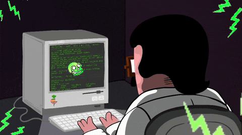

<!-- Full-width Banner -->

  

<h1 align="center">Hey there 👋, I'm Amil Mahajan</h1>

<!-- Who Am I section with image floated right -->
<h3>🚀 Who Am I?</h3>

  

<ul>
  <li>📠CSE undergrad with a passion for innovation and automation @VIT Vellore</li> 
  <li>🤖 Enthusiast in Generative AI, Machine Learning, and Blockchain Technologies</li> 
  <li>🛠️ Crafting intelligent solutions and real-world systems that make a difference</li> 
  <li>💡 Skilled in Python, C++, React, MongoDB, Node.js, and Arduino</li> 
  <li>🌠Dedicated to developing innovative software that drives positive social change</li> 
</ul>

---

### ⚙️ My Tech Toolbox

  
  
  
  
  
  
  
  
  

---

### 📊 My GitHub Pulse

  
  
   
  

---

### 🌐 Let's Connect

  
  &nbsp;&nbsp;&nbsp;
  
  &nbsp;&nbsp;&nbsp;
  

---

<i>“💡 Driven by curiosity, powered by caffeine, built with code.”</i>

